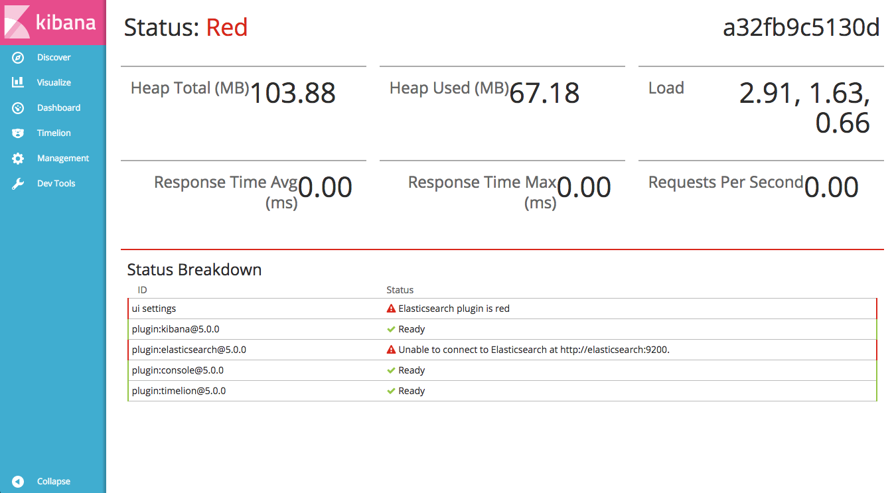
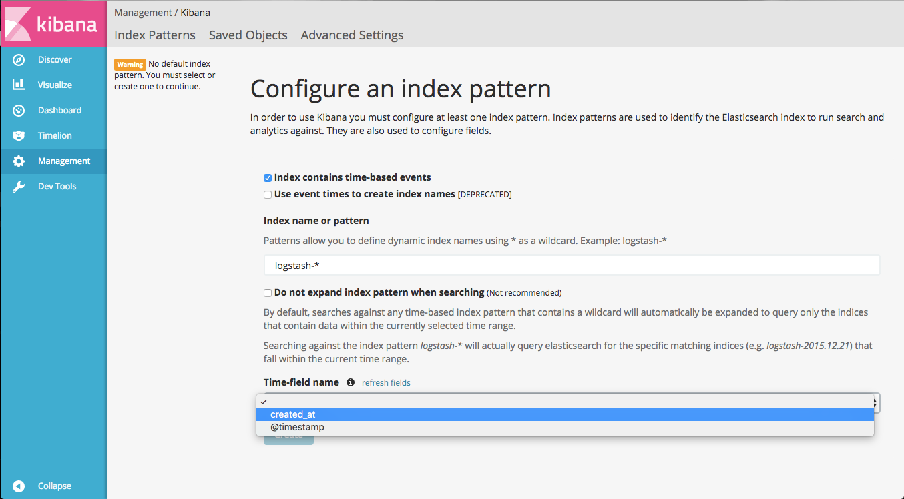

# Halo ELK

## ELK stack with a CloudPassage Halo event injector

Making things a little easier...

So you want to see what CloudPassage Halo events look like in Kibana, but don't
want to spend the time setting up the ELK stack... then try this.  It'll create
the ELK stack and instantiate an event injection container
(docker.io/ashmastaflash/halo_filebeat) to get the events from your Halo
environment into a clean instance of Kibana.

### Requirements

* Read-only (sometimes referred to as 'Audit') API keys for CloudPassage Halo.  
* Docker-compose: https://docs.docker.com/compose/install/

### Using

You'll need to set two environment variables before you begin:

| var                 | purpose                             |
|---------------------|-------------------------------------|
| HALO_API_KEY        | Also referred to as Halo API ID     |
| HALO_API_SECRET_KEY | Sometimes referred to as API Secret |

1. Clone down this repository and descend into the halo_elk directory
1. Run: `docker-compose up -d --build`.
1. Open a browser and navigate to http://localhost:5601

If you see this:

Don't worry.  Kibana usually gets ready before Elasticsearch does.  Give it a
few minutes and refresh.  You should eventually see this:

Select created_at for the time-field name and click on 'Create'.

Now, navigate to 'Discover' and go nuts!
